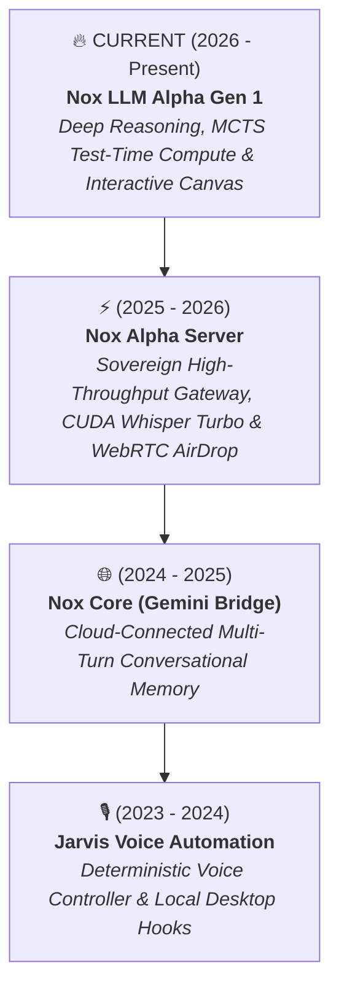

<div align="center">

# Sk Masud Rahaman
### Founder & Principal AI Systems Architect • [Falcon Intelligence](https://github.com/SkMasud18)
*Architect of [NoxAssistant.com](https://noxassistant.com) — Sovereign Multi-Modal Cognitive Intelligence*

[](https://noxassistant.com)
[](https://huggingface.co/SkMasud58)
[](https://github.com/SkMasud18)
[](https://github.com/SkMasud18)

<p align="center">
  Designing sovereign, high-throughput distributed AI backends, hardware-accelerated speech pipelines, and test-time compute reasoning engines.
</p>

</div>

---

## 🏛️ The Engineering Evolution of Nox Intelligence

From deterministic rule-based OS automation to a sovereign cognitive foundation model.



---

## 🚀 Flagship Projects & Engineering Milestones (Recent ➔ Genesis)

### 1️⃣ [Nox LLM Alpha Gen 1: Sovereign Deep Reasoning](https://github.com/SkMasud18/Nox-LLM-Alpha-Gen-1) *(Active / Flagship)*
> **The Apex Cognitive Brain (2026)** — Frontier-class foundation architecture with dynamic Test-Time Compute (TTC) scaling, Monte-Carlo Tree Search (MCTS) reasoning trajectory exploration, formal mathematical invariant verification, and interactive split-pane Canvas artifacts.
> * **Tech:** PyTorch, FlashAttention-3, Multi-Head Latent Attention (MLA), SwiGLU, Invariant Verifiers, Canvas Sandbox.
> * **Live Model Card:** [Hugging Face / SkMasud58/Nox-LLM-Alpha-Gen-1](https://huggingface.co/SkMasud58/Nox-LLM-Alpha-Gen-1)

---

### 2️⃣ [Nox Alpha Server: Distributed AI Architecture](https://github.com/SkMasud18/Nox-Alpha-Server)
> **The Sovereign Production Stack (2025 - 2026)** — High-throughput distributed backend powering [NoxAssistant.com](https://noxassistant.com). Features custom FastAPI async gateway, hardware-accelerated CUDA Whisper Turbo STT (<800ms latency, native Bengali/Hindi/Urdu/English scripts), 3-Tier Multi-LLM Router, WebRTC P2P AirDrop, and sliding-window rate limiters.
> * **Tech:** FastAPI, PyTorch CUDA 12, Faster-Whisper, Silero VAD, WebRTC DataChannels, Redis, Docker.

---

### 3️⃣ [Nox Core: Cloud Cognitive Bridge](https://github.com/SkMasud18/Nox-Core-Gemini)
> **The LLM Paradigm Shift (2024 - 2025)** — Transitioned Nox from rule-based scripts to contextual generative dialogue. Engineered streaming SSE bridges with multi-turn memory buffers and real-time response generation.
> * **Tech:** Python, Google Gemini SDK, SSE Streaming, Sliding Context Manager.

---

### 4️⃣ [Jarvis: Desktop Voice Automation](https://github.com/SkMasud18/Jarvis-Voice-Automation) *(The Genesis)*
> **Deterministic OS Controller (2023 - 2024)** — The earliest iteration of Nox. Deterministic speech recognition pipeline with intent parsing and desktop automation dispatchers for YouTube, WhatsApp, and local system monitoring.
> * **Tech:** Python, SpeechRecognition, PyTTSx3, OS Automation Hooks.

---

## 🛠️ Core Tech Stack & Tooling

```
  Systems & AI Backend:   Python 3.11+, PyTorch 2.4, CUDA 12+, FastAPI, CTranslate2, Redis, PostgreSQL, Docker
  Reasoning & Inference:  MCTS Search, Test-Time Compute (TTC), FlashAttention-3, Multi-Head Latent Attention (MLA)
  Voice & Audio STT:      Faster-Whisper (Turbo / Large-v3), VAD (Silero), WebRTC DataChannels, FFmpeg
  Frontend & Mobile:      TypeScript, React 19, Vite, TailwindCSS, Motion, WebSockets, SSE
```

---

## 🌐 Production Ecosystem Links

* 🚀 **Nox Assistant Platform:** [noxassistant.com](https://noxassistant.com)
* 💬 **AI Workspace & Chat:** [noxassistant.com/chat](https://noxassistant.com/chat/)
* 💎 **Sovereign Tier Engine:** [noxassistant.com/pricing](https://noxassistant.com/pricing/)
* 📂 **Encrypted Cloud Drive:** [noxassistant.com/drive](https://noxassistant.com/drive/)
* 🤝 **Partner Console & RBAC:** [noxassistant.com/partner](https://noxassistant.com/partner/)
* 🤗 **Hugging Face Hub:** [huggingface.co/SkMasud58](https://huggingface.co/SkMasud58)
* 🎮 **Interactive Web Playground:** [Nox Alpha Playground](https://huggingface.co/spaces/SkMasud58/Nox-Alpha-Playground)

---

<div align="center">
  <sub>Engineered by <b>Sk Masud Rahaman</b> • <b>Falcon Intelligence</b></sub>
</div>
