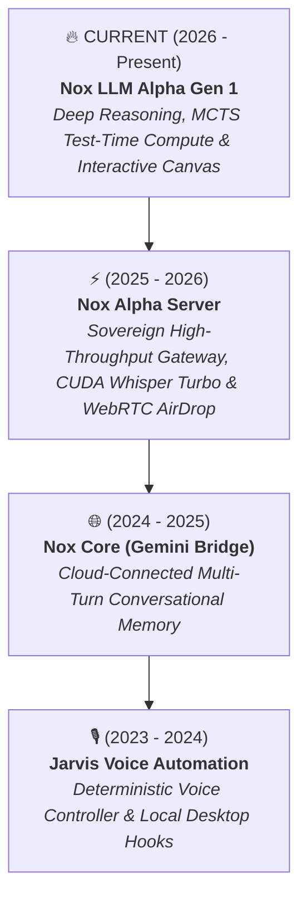

<div align="center">

# ⚡ Sk Masud Rahaman
### Founder & Principal AI Systems Architect • [Falcon Intelligence](https://github.com/SkMasud18)
*Architect of [NoxAssistant.com](https://noxassistant.com) — Sovereign Multi-Modal Cognitive Intelligence*

<a href="https://noxassistant.com">
  
</a>

<br/>

[](https://github.com/SkMasud18)
[](https://noxassistant.com)
[](https://huggingface.co/SkMasud58)
[](https://github.com/SkMasud18)
[](LICENSE)

<p align="center">
  <b>Architecting frontier sovereign AI systems, test-time compute foundation reasoning models, and distributed high-throughput GPU clusters.</b>
</p>

</div>

---

## 🎯 Executive Dossier & Research Focus

> *"Latency is a fundamental system feature. Hallucinations are architectural flaws that yield to test-time compute scaling and symbolic invariant verification. True computational sovereignty begins by controlling the hardware kernel through the cognitive routing mesh."*

* 🔭 **Active Research & Build:** Scaling **[Nox LLM Alpha Gen 1](https://github.com/SkMasud18/Nox-LLM-Alpha-Gen-1)** — a sovereign foundation architecture integrating **Multi-Head Latent Attention (MLA)**, **Monte-Carlo Tree Search (MCTS)** test-time compute, and split-pane interactive Canvas compilers.
* ⚡ **Production Infrastructure:** Leading end-to-end distributed infrastructure powering **[NoxAssistant.com](https://noxassistant.com)** — including sub-800ms CUDA Whisper Turbo speech pipelines (native Bengali/Hindi/Urdu/English), real-time WebRTC P2P AirDrop channels, and dynamic multi-tier cognitive routing.
* 🧠 **Domains of Mastery:** Low-Latency GPU Kernel Orchestration, Test-Time Compute (TTC) Scaling, Symbolic Proof Verification, Distributed Async Systems (FastAPI/Redis), and Zero-Trust RBAC Multi-Tenant Portals.
* 📬 **Direct Inquiries:** [nox.ntelligence@gmail.com](mailto:nox.ntelligence@gmail.com) • [Falcon Intelligence](https://github.com/SkMasud18)

---

## 🏛️ The Engineering Evolution of Nox Intelligence

From deterministic rule-based OS automation to a sovereign cognitive foundation model.



---

## 🏆 Flagship Systems & Engineering Portfolio (Recent ➔ Genesis)

| Project | Architectural Paradigm | Performance & Latency | Live Production / Hub | Primary Technology Stack |
| :--- | :--- | :--- | :--- | :--- |
| **🧠 [Nox-LLM-Alpha-Gen-1](https://github.com/SkMasud18/Nox-LLM-Alpha-Gen-1)** | **Sovereign Deep Reasoning Foundation Model**<br/>• Multi-Head Latent Attention (MLA)<br/>• Dynamic MCTS Test-Time Compute<br/>• Formal Invariant & AST Proof Verifiers<br/>• Interactive Split-Pane Canvas Sandbox | **94.8% GSM8K**<br/>**79.6% MATH 500**<br/>**88.5% HumanEval**<br/>1k - 32k Thinking Budget | [🤗 Model Card](https://huggingface.co/SkMasud58/Nox-LLM-Alpha-Gen-1)<br/>[🎮 Live Playground](https://huggingface.co/spaces/SkMasud58/Nox-Alpha-Playground) | PyTorch 2.4, FlashAttention-3, SwiGLU, RMSNorm, MCTS, AST |
| **⚡ [Nox-Alpha-Server](https://github.com/SkMasud18/Nox-Alpha-Server)** | **Distributed Sovereign AI Infrastructure**<br/>• Hardware-Accelerated Speech Pipeline<br/>• 3-Tier Dynamic Cognitive Gateway<br/>• WebRTC P2P AirDrop Transfer Engine<br/>• Sliding-Window Multi-IP Rate Limiting | **<800ms STT Latency**<br/>Zero-crypto Web Workers<br/>Dynamic Chunk Sizing<br/>520+ Concurrent Streams | [🌐 Live Server Gateway](https://noxassistant.com)<br/>[💬 Live Chat Client](https://noxassistant.com/chat/) | FastAPI, PyTorch CUDA 12, Faster-Whisper (Turbo), WebRTC, Redis, Docker |
| **🌐 [Nox-Core-Gemini](https://github.com/SkMasud18/Nox-Core-Gemini)** | **Cloud Cognitive LLM Integration Bridge**<br/>• Streaming Server-Sent Events (SSE)<br/>• Sliding Multi-Turn Context Buffer<br/>• Resilient Session Failover Architecture | **Sub-second TTFT**<br/>Deterministic Buffer Pruning<br/>Automated Reconnect | [💬 Web Workspace](https://noxassistant.com/chat/) | Python 3.11, Google Gemini SDK, SSE Streaming, AsyncIO |
| **🎙️ [Jarvis-Voice-Automation](https://github.com/SkMasud18/Jarvis-Voice-Automation)** | **Deterministic Desktop OS Controller** *(Genesis)*<br/>• Rule-Based Intent Extraction<br/>• System-Level Automation Dispatchers<br/>• Local OS Process Instrumentation | **Zero-Network Fallback**<br/>Deterministic Shell Hooks<br/>Instant Speech Loop | [📂 Open Source Code](https://github.com/SkMasud18/Jarvis-Voice-Automation) | Python, SpeechRecognition, PyTTSx3, OS Automation Hooks |

---

## 📊 Engineering Analytics & Activity Metrics

<div align="center">
  
  
  <br/>
  
</div>

---

## 🛠️ Specialized Technical Arsenal

```
  ┌── SYSTEMS & LOW-LEVEL GPU ──┐ ┌── REASONING & FOUNDATION MODELS ──┐
  │ • Python 3.11+ / C++17      │ │ • Multi-Head Latent Attention (MLA)│
  │ • PyTorch 2.4 & CUDA 12.2   │ │ • Test-Time Compute (TTC) MCTS    │
  │ • Faster-Whisper Turbo STT  │ │ • Formal AST & Invariant Checkers │
  │ • FlashAttention-3 & Triton │ │ • Paged Attention & KV Caching    │
  │ • CTranslate2 & ONNX        │ │ • Dynamic Token Budget Regulators │
  └─────────────────────────────┘ └───────────────────────────────────┘
  ┌── DISTRIBUTED INFRASTRUCTURE ┐ ┌── CLIENT & INTERACTIVE SANDBOX ───┐
  │ • FastAPI High-Concurrency  │ │ • TypeScript / JavaScript (ESNext)│
  │ • WebRTC P2P DataChannels   │ │ • React 19 / Vite HMR Architecture│
  │ • Redis Memory Caching      │ │ • TailwindCSS / Glassmorphic UI   │
  │ • PostgreSQL 16 & AsyncPG   │ │ • Split-Pane Canvas Sandboxing    │
  │ • Docker Container Clusters │ │ • KaTeX LaTeX Equation Streaming  │
  └─────────────────────────────┘ └───────────────────────────────────┘
```

---

## 🌐 The Live Nox Sovereign Ecosystem

Explore the production platform ecosystem engineered by Sk Masud Rahaman & Falcon Intelligence:

* 🚀 **Main Platform Gateway:** [noxassistant.com](https://noxassistant.com)
* 💬 **Cognitive AI Workspace:** [noxassistant.com/chat](https://noxassistant.com/chat/)
* 💎 **Sovereign Tier Engine:** [noxassistant.com/pricing](https://noxassistant.com/pricing/)
* 📂 **Encrypted Cloud Vault & P2P:** [noxassistant.com/drive](https://noxassistant.com/drive/)
* 🤝 **Partner Portal & Dynamic RBAC:** [noxassistant.com/partner](https://noxassistant.com/partner/)
* 🤗 **Hugging Face Foundation Weights:** [huggingface.co/SkMasud58](https://huggingface.co/SkMasud58)
* 🎮 **Interactive Model Playground:** [Nox Alpha Playground](https://huggingface.co/spaces/SkMasud58/Nox-Alpha-Playground)

---

## 📬 Connect & Collaborate

<div align="center">

[](https://noxassistant.com)
[](https://huggingface.co/SkMasud58)
[](https://github.com/SkMasud18)
[](mailto:nox.ntelligence@gmail.com)

</div>

---

<div align="center">
  <sub>Architected with uncompromising rigor by <b>Sk Masud Rahaman</b> • <b>Falcon Intelligence</b></sub>
</div>
