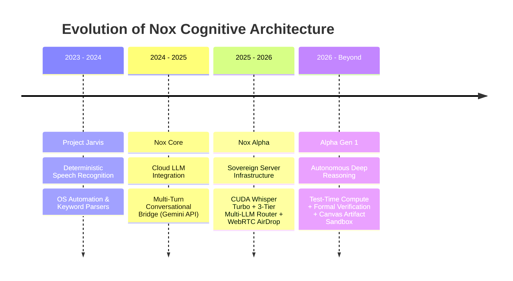

<div align="center">

# Hi there, I'm Sk Masud Rahaman 👋
### Cybersecurity & AI Systems Architect | Co-Founder & CTO @ [Nox Intelligence](https://noxassistant.com)

[](https://noxassistant.com)
[](https://huggingface.co/SkMasud58)
[](https://fastapi.tiangolo.com)
[](https://developer.nvidia.com/cuda-zone)

<p align="center">
  <i>"Architecting sovereign autonomous intelligence, low-latency cognitive infrastructure, and privacy-first multi-agent systems."</i>
</p>

---

</div>

## 🌌 Architectural Philosophy

I specialize in bridging the gap between **raw cognitive AI models** and **hardened, sub-second production infrastructure**. My work spans the entire AI lifecycle:
* **High-Throughput Distributed Backends:** Asynchronous event loops, SSE token streaming, memory pooling, and sliding-window rate limiters.
* **Low-Latency Audio Intelligence:** Real-time CUDA-accelerated Whisper Turbo transcription (<800ms TTFT) with native multilingual script preservation.
* **Deep Autonomous Reasoning:** Multi-tier dynamic compute allocation, test-time reasoning verification, and interactive Canvas sandbox environments.
* **Zero-Leakage Privacy Enclaves:** Sovereign multi-agent architectures where user context, files, and identity remain mathematically isolated.

---

## 🚀 The AI Evolution: 4 Milestone Projects

Here is the engineering trajectory that led to the creation of **Nox Intelligence**:



### 1️⃣ [Jarvis: Voice Automation & OS Controller](https://github.com/SkMasud18/Jarvis-Voice-Automation)
> **The Genesis** — A deterministic Python voice assistant built with offline speech recognition and desktop operating system automation hooks (WhatsApp, Spotify, system telemetry, browser automation).

### 2️⃣ [Nox Core: Cloud LLM Integration](https://github.com/SkMasud18/Nox-Core-Gemini)
> **The LLM Evolution** — Transitioned from static keyword matching to multi-turn cognitive conversation using the Google Gemini API. Introduced real-time SSE streaming, dynamic system prompt governance, and intent classification.

### 3️⃣ [Nox Alpha: Sovereign Distributed Server](https://github.com/SkMasud18/Nox-Alpha-Server)
> **The Autonomous Hybrid Platform** — Self-hosted enterprise server stack powering [NoxAssistant.com](https://noxassistant.com). Features custom FastAPI async gateway, CUDA-accelerated Whisper-large-v3-turbo STT (<800ms latency), 3-Tier Multi-LLM Router, WebRTC P2P AirDrop, and Redis token rate limiting.

### 4️⃣ [Alpha Gen 1: Deep Reasoning & Canvas Engine](https://github.com/SkMasud18/Alpha-Gen-1)
> **Autonomous Cognitive Brain** — State-of-the-art test-time compute scaling engine. Integrates multi-step mathematical verification, code execution sandboxes, and interactive split-pane Canvas artifacts.

---

## 🛠️ Core Tech Stack & Tooling

```
  Systems & AI Backend:   Python 3.11+, FastAPI, PyTorch, CTranslate2, CUDA 12+, Redis, PostgreSQL
  Voice & Audio STT:      Faster-Whisper (Turbo / Large-v3), VAD (Silero), WebRTC, SoundFile
  Frontend & Mobile:      TypeScript, React 19, Vite, TailwindCSS v4, Motion, Tauri v2, Capacitor
  Infrastructure & Ops:   Linux (Ubuntu Server), Nginx Reverse Proxy, Docker, Systemd Daemons, Git
  Security & Protocol:    AES-256 Memory Enclave, Sliding-Window Token Bucket, P2P WebRTC Signaling
```

---

## 📊 Live Ecosystem & Public Benchmarks

* 🌐 **Production Web Platform:** [noxassistant.com](https://noxassistant.com)
* 🤗 **Hugging Face Model Repositories:**
  * [SkMasud58/Nox-Alpha](https://huggingface.co/SkMasud58/Nox-Alpha) — Hybrid Autonomous Reasoning Model
  * [SkMasud58/Alpha-Gen-1](https://huggingface.co/SkMasud58/Alpha-Gen-1) — Deep Cognitive Architecture
* 🎮 **Interactive Playground:** [Nox Alpha Space](https://huggingface.co/spaces/SkMasud58/Nox-Alpha-Playground)

---

<div align="center">
  <sub>Engineered with precision by <b>Sk Masud Rahaman</b> • Falcon Intelligence © 2026</sub>
</div>
